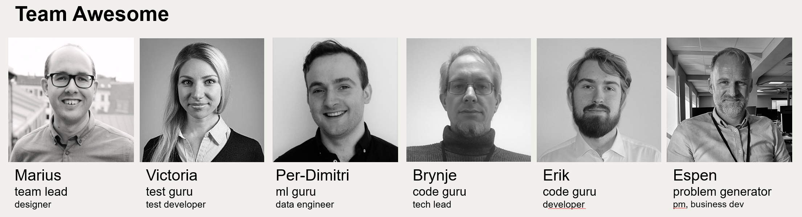

# Miljøhack 2021 Posten
[App workflow](https://github.com/brynjen/miljohack2021/actions/workflows/dart.yml/badge.svg)

Flutter project for Miljøhack 2021.
Team: 

## Quick walkThrough of project

- Uses domain driven design
- Designed for iOS and Android
- Uses Firebase as backend
- Startpoint of it is [main.dart]
- Project kanban is available at github

## Risk analysis
To look deeper into our risk analysis check out []

## Icon update
To update icon, upload [assets/icons/config.json] to [FlutterIcons](https://www.fluttericons.com),
add your desired icons and download file. Step by step:
1. Unzip, rename MiljoHack.tff to miljo_hack.tff and move it to [assets/icons/] and replace the 
   existing one.
2. Move the config.json to [assets/icons]
3. Move the miljo_hack_icons.dart to [presentation/core/icons/] and overwrite existing file